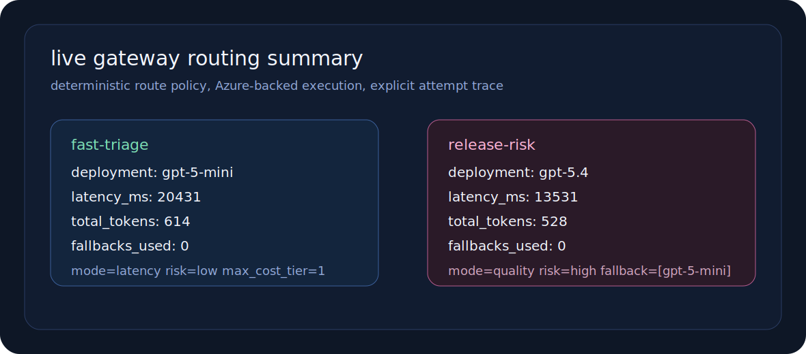
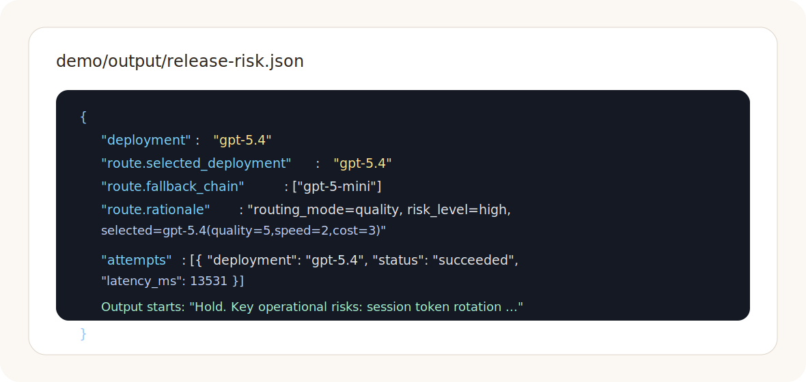

# multi-ai-gateway

Route first. Execute second.

This repo is a narrow gateway for teams that already know one thing: model routing should be explainable and deterministic before a provider call is made.

The router in this project decides which deployment should run a request from a small set of application-owned inputs:

- `routing_mode`: latency, balanced, or quality
- `risk_level`: low, medium, or high
- `requires_json`
- optional cost cap and deployment allow-list

After that decision is made, the gateway executes the request against Azure OpenAI and records the route trace and attempt history.

## What Runs Here

- deterministic route policy
- Azure-backed execution across multiple deployments
- fallback chain when the primary deployment fails
- FastAPI surface for a unified completion endpoint
- CLI for replaying routed scenarios
- checked-in live demo artifacts showing route choice and served output

This is not a universal proxy for every model API on the market. It is the part that matters first: route policy you can defend in a design review.

## Live Demo

The checked-in demo set was generated against Azure OpenAI with:

- `gpt-5-mini` as the fast lane
- `gpt-5.4` as the quality lane

Scenarios:

- `fast-triage`: low-risk incident summary with a strict cost cap
- `release-risk`: high-risk release review that routes to the heavier model

Artifacts:

- `demo/input/fast-triage.json`
- `demo/input/release-risk.json`
- `demo/output/fast-triage.json`
- `demo/output/release-risk.json`
- `demo/output/demo-summary.json`

Rendered route captures:




Observed summary:

```json
[
  {
    "name": "fast-triage",
    "deployment": "gpt-5-mini",
    "latency_ms": 20431,
    "total_tokens": 614,
    "fallbacks_used": 0
  },
  {
    "name": "release-risk",
    "deployment": "gpt-5.4",
    "latency_ms": 13531,
    "total_tokens": 528,
    "fallbacks_used": 0
  }
]
```

Route trace shape:

```json
{
  "selected_deployment": "gpt-5.4",
  "fallback_chain": ["gpt-5-mini"],
  "rationale": "routing_mode=quality, risk_level=high, selected=gpt-5.4(quality=5,speed=2,cost=3)"
}
```

## Python API

```python
from multi_ai_gateway import (
    AzureChatProvider,
    Gateway,
    GatewayRequest,
    Settings,
    ChatMessage,
)

settings = Settings.from_env()
gateway = Gateway(
    provider=AzureChatProvider(settings),
    deployments=settings.default_deployments(),
)

response = gateway.complete(
    GatewayRequest(
        messages=[
            ChatMessage(role="system", content="Respond in 4 bullets max."),
            ChatMessage(role="user", content="Summarize the incident for the on-call."),
        ],
        routing_mode="latency",
        risk_level="low",
        max_cost_tier=1,
    )
)

print(response.deployment)
print(response.route.rationale)
print(response.output_text)
```

## API

Install:

```bash
uv sync --extra dev
```

Start the gateway:

```bash
export AZURE_OPENAI_ENDPOINT="https://<resource>.openai.azure.com/"
export AZURE_OPENAI_API_KEY="<key>"
export AZURE_OPENAI_API_VERSION="2025-04-01-preview"
export MULTI_AI_GATEWAY_FAST_DEPLOYMENT="gpt-5-mini"
export MULTI_AI_GATEWAY_QUALITY_DEPLOYMENT="gpt-5.4"

uv run uvicorn multi_ai_gateway.main:app --app-dir src --reload
```

Create a completion:

```bash
curl -sS http://127.0.0.1:8000/v1/complete \
  -H "content-type: application/json" \
  -d @demo/input/fast-triage.json
```

## CLI

```bash
uv run mag complete \
  --input-file demo/input/release-risk.json \
  --out /tmp/release-risk.json
```

Regenerate the checked-in live demo:

```bash
uv run python scripts/run_live_demo.py
```

## Design Notes

- route selection is local and deterministic
- execution is provider-backed and replaceable
- route rationale is preserved in the response
- fallback is explicit and ordered

If the provider fails on every route attempt, the gateway raises instead of hiding the failure behind an invented answer.

## Files Worth Reading

- `src/multi_ai_gateway/router.py`
- `src/multi_ai_gateway/gateway.py`
- `src/multi_ai_gateway/azure_provider.py`
- `src/multi_ai_gateway/main.py`
- `scripts/run_live_demo.py`
- `docs/architecture.md`
- `docs/azure-foundry.md`

## Tests

```bash
uv run pytest -q
```
